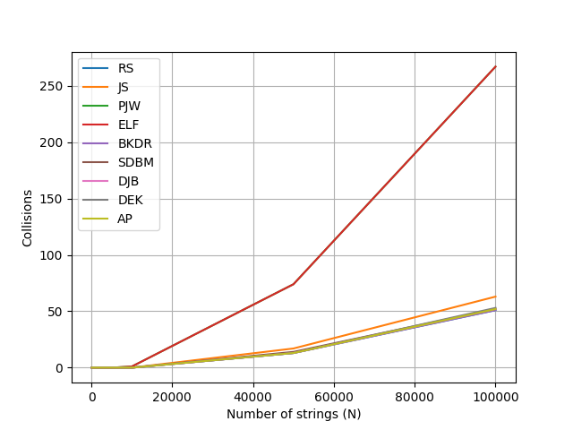

# Сравнение хеш-функций по числу коллизий

## Результаты

| N | RS | JS | PJW | ELF | BKDR | SDBM | DJB | DEK | AP |
|------:|---:|---:|----:|----:|-----:|-----:|----:|----:|---:|
| 100 | 0 | 0 | 0 | 0 | 0 | 0 | 0 | 0 | 0 |
| 500 | 0 | 0 | 0 | 0 | 0 | 0 | 0 | 0 | 0 |
| 1 000 | 0 | 0 | 0 | 0 | 0 | 0 | 0 | 0 | 0 |
| 5 000 | 0 | 0 | 0 | 0 | 0 | 0 | 0 | 0 | 0 |
| 10 000 | 0 | 0 | 1 | 1 | 0 | 0 | 0 | 0 | 0 |
| 50 000 | 13 | 17 | 74 | 74 | 13 | 14 | 13 | 13 | 13 |
| 100 000 | 51 | 63 | 267 | 267 | 51 | 52 | 52 | 53 | 52 |

## График

## Анализ

При малых N коллизий нет ни у одной функции — слишком мало строк, чтобы две из них попали в одну ячейку. Коллизии начинают появляться у PJW и ELF при N = 10 000, у остальных — при N < 50 000. После этого порога число коллизий растёт быстро.

**Лучшие — RS, BKDR, SDBM, DJB, DEK, AP**
51–53 коллизии при N = 100 000, результаты практически неразличимы.

**Средняя — JS**
63 коллизии — на ~20% хуже лучших.

**Худшие — PJW и ELF**
267 коллизий — в 5 раз хуже остальных. Обе функции принудительно обнуляют часть хеша на каждой итерации, из-за чего эффективно используют меньше 32 бит.****